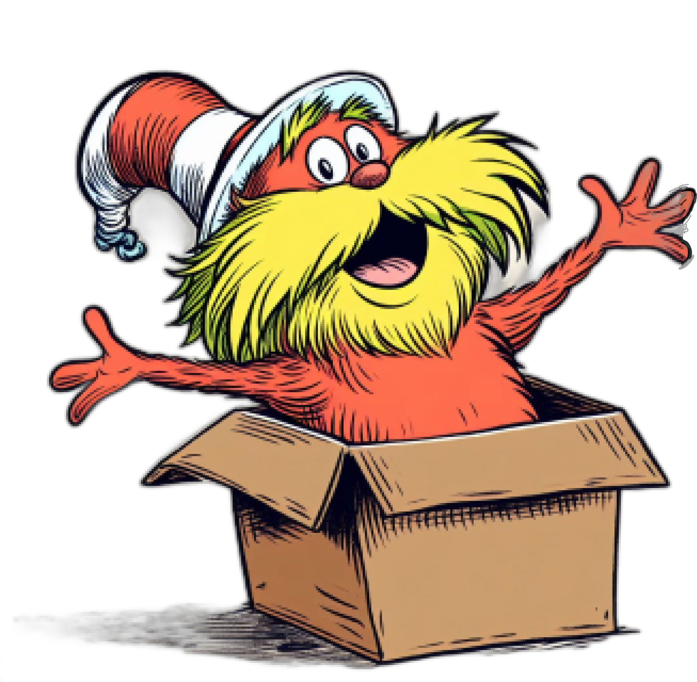

# LoRAX

<p align="center">
    
</p>
<p align="center">
    <em>Multi-LoRA inference server that scales to 1000s of fine-tuned LLMs</em>
</p>
<p align="center">

<a href="https://discord.gg/CBgdrGnZjy" target="_blank" style="text-decoration: none;">
    
</a>
<a href="https://github.com/predibase/lorax/blob/master/LICENSE" target="_blank" style="text-decoration: none;">
    
</a>
<a href="https://artifacthub.io/packages/search?repo=lorax" target="_blank" style="text-decoration: none;">
    
</a>
</p>

---

## 📖 What is LoRAX?

LoRAX (LoRA eXchange) is a framework that allows users to serve thousands of fine-tuned models on a single GPU, dramatically reducing the cost of serving without compromising on throughput or latency.

## 🌳 Features

- 🚅 **Dynamic Adapter Loading:** include any fine-tuned LoRA adapter in your request, it will be loaded just-in-time without blocking concurrent requests.
- 🏋️‍♀️ **Heterogeneous Continuous Batching:** packs requests for different adapters together into the same batch, keeping latency and throughput nearly constant with the number of concurrent adapters.
- 🧁 **Adapter Exchange Scheduling:** asynchronously prefetches and offloads adapters between GPU and CPU memory, schedules request batching to optimize the aggregate throughput of the system.
- 👬 **Optimized Inference:**  high throughput and low latency optimizations including tensor parallelism, pre-compiled CUDA kernels ([flash-attention](https://arxiv.org/abs/2307.08691), [paged attention](https://arxiv.org/abs/2309.06180), [SGMV](https://arxiv.org/abs/2310.18547)), quantization, token streaming.
- 🚢  **Ready for Production** prebuilt Docker images, Helm charts for Kubernetes, Prometheus metrics, and distributed tracing with Open Telemetry.
- 🤯 **Free for Commercial Use:** Apache 2.0 License. Enough said 😎.


<p align="center">
  
</p>


## 🏠 Models

Serving a fine-tuned model with LoRAX consists of two components:

- [Base Model](./models/base_models.md): pretrained large model shared across all adapters.
- [Adapter](./models/adapter.md): task-specific adapter weights dynamically loaded per request.

LoRAX supports a number of Large Language Models as the base model including [Llama](https://huggingface.co/meta-llama) (including [CodeLlama](https://huggingface.co/codellama)), [Mistral](https://huggingface.co/mistralai) (including [Zephyr](https://huggingface.co/HuggingFaceH4/zephyr-7b-beta)), and [Qwen](https://huggingface.co/Qwen). See [Supported Architectures](./models/base_models.md#supported-architectures) for a complete list of supported base models.

Base models can be loaded in fp16 or quantized with `bitsandbytes`, [GPT-Q](https://arxiv.org/abs/2210.17323), or [AWQ](https://arxiv.org/abs/2306.00978).

Supported adapters include LoRA adapters trained using the [PEFT](https://github.com/huggingface/peft) and [Ludwig](https://ludwig.ai/) libraries. Any of the linear layers in the model can be adapted via LoRA and loaded in LoRAX.

## 🏃‍♂️ Getting started with Docker

We recommend starting with our pre-built Docker image to avoid compiling custom CUDA kernels and other dependencies.

### Launch LoRAX Server

```shell
model=mistralai/Mistral-7B-Instruct-v0.1
volume=$PWD/data

docker run --gpus all --shm-size 1g -p 8080:80 -v $volume:/data \
    ghcr.io/predibase/lorax:latest --model-id $model
```

For a full tutorial including token streaming and the Python client, see [Getting Started - Docker](./getting_started/docker.md).

### Prompt via REST API

Prompt base LLM:

```shell
curl 127.0.0.1:8080/generate \
    -X POST \
    -d '{"inputs": "[INST] Natalia sold clips to 48 of her friends in April, and then she sold half as many clips in May. How many clips did Natalia sell altogether in April and May? [/INST]", "parameters": {"max_new_tokens": 64}}' \
    -H 'Content-Type: application/json'
```

Prompt a LoRA adapter:

```shell
curl 127.0.0.1:8080/generate \
    -X POST \
    -d '{"inputs": "[INST] Natalia sold clips to 48 of her friends in April, and then she sold half as many clips in May. How many clips did Natalia sell altogether in April and May? [/INST]", "parameters": {"max_new_tokens": 64, "adapter_id": "vineetsharma/qlora-adapter-Mistral-7B-Instruct-v0.1-gsm8k"}}' \
    -H 'Content-Type: application/json'
```

See [Reference - REST API](./reference/rest_api.md) for full details.

### Prompt via Python Client

Install:

```shell
pip install lorax-client
```

Run:

```python
from lorax import Client

client = Client("http://127.0.0.1:8080")

# Prompt the base LLM
prompt = "[INST] Natalia sold clips to 48 of her friends in April, and then she sold half as many clips in May. How many clips did Natalia sell altogether in April and May? [/INST]"
print(client.generate(prompt, max_new_tokens=64).generated_text)

# Prompt a LoRA adapter
adapter_id = "vineetsharma/qlora-adapter-Mistral-7B-Instruct-v0.1-gsm8k"
print(client.generate(prompt, max_new_tokens=64, adapter_id=adapter_id).generated_text)
```

See [Reference - Python Client](./reference/python_client.md) for full details.

For other ways to run LoRAX, see [Getting Started - Kubernetes](./getting_started/kubernetes.md) and [Getting Started - Local](./getting_started/local.md).

## 🙇 Acknowledgements

LoRAX is built on top of HuggingFace's [text-generation-inference](https://github.com/huggingface/text-generation-inference), forked from v0.9.4 (Apache 2.0).

We'd also like to acknowledge [Punica](https://github.com/punica-ai/punica) for their work on the SGMV kernel, which is used to speed up multi-adapter inference under heavy load.

## 🗺️ Roadmap

Our roadmap is tracked [here](https://github.com/predibase/lorax/issues/57).
