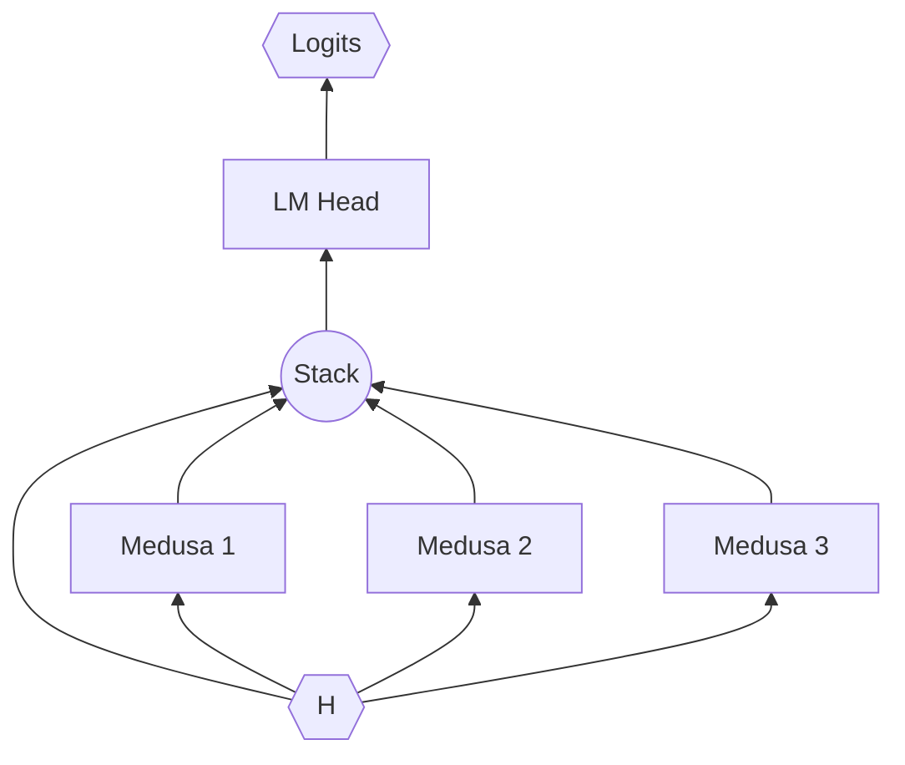

# Medusa

[Medusa](https://arxiv.org/abs/2401.10774) is a [speculative decoding](../../guides/speculative_decoding.md) method
that trains new projection layers (similar to LoRA layers) for the purpose of predicting future tokens and speedng up
the text generation process.

## How it works



The goal of Medusa is to speed up text generation. Unlike LoRA, Medusa does not aim to improve response quality, and in
fact enabling Medusa will have no effect at all on the model output itself. Instead, Medusa works by adding additional
projections (called "medusa heads") that the last hidden state `H` of the LLM is passed through that attempt to predict
the next N tokens (rather than just the next 1 token).

The result is that the output logit shape of the model at each decoding step is no longer `[B, 1, V]` for batch size `B` and vocabulary
size `V`, but instead `[B, S, V]` where `S` is the number of Medusa speculative heads `N` plus `1` for the original model
head.

See the [Speculative Decoding](../../guides/speculative_decoding.md#verification) guide for more information on the verification
step that follows.

### Change in v2

The original implementation of Medusa trained separate LM head layers for each Medusa head. This introduced significant
memory overhead that made dynamic loading of these adapters prohibitive. In v2, Medusa heads now reuse the base model
LM head, reducing memory overhead by an order of magnitude.

LoRAX supports both v1 and v2 Medusa adapters, but only allows dynamic loading for v2 adapters. To see which version
your Medusa adapter is, check the `config.json` file for the `version` property. If not specified, the adapter is
assumed to be v1.

## Usage

### Initializing LoRAX with Medusa

In order to use Medusa speculative decoding in LoRAX, you must initialize the LoRAX server with a valid Medusa adapter
as the "default" adapter. This means that by default every request will use the default Medusa adapter unless overriden
by the request parameters.

Example:

```bash
docker run --gpus all --shm-size 1g -p 8080:80 -v $PWD:/data \
    ghcr.io/predibase/lorax:main \
    --model-id mistralai/Mistral-7B-Instruct-v0.2 \
    --adapter-id predibase/Mistral-7B-Instruct-v0.2-medusa
```

### Dynamic Medusa per Request

When using a v2 Medusa adapter as default, you can also apply per-request Medusa adapters (that must also be v2) to
specialize the speculative decoding to the particular task.

For example, you might have a general-purpose Medusa adapter as the default that improves throughput for most prompts
by ~50%. But if you know your incoming request is for code generation, you might want to apply a task-specific Medusa
adapter trained on only code generation examples for a ~100% speedup:

=== "Python"

    ```python
    from lorax import Client

    client = Client("http://127.0.0.1:8080")
    prompt = "[INST] Write a Python function that takes a list of strings as input and returns a new list containing only the strings that are palindromes. [/INST]"

    resp = client.generate(
        prompt,
        adapter_id="predibase/Mistral-7B-Instruct-v0.2-magicoder-medusa",
    )
    print(resp.generated_text)
    ```

=== "REST"

    ```bash
    curl 127.0.0.1:8080/generate \
        -X POST \
        -d '{
            "inputs": "[INST] Write a Python function that takes a list of strings as input and returns a new list containing only the strings that are palindromes. [/INST]",
            "parameters": {
                "adapter_id": "predibase/Mistral-7B-Instruct-v0.2-magicoder-medusa"
            }
        }' \
        -H 'Content-Type: application/json'
    ```

The one caveat to using per request Medusa adapters is that **adapters loaded per request must have the same number of
Medusa heads as the default Medusa adapter**. This is because for now the number of speculative tokens generated per
step is a constant defined during initialization.

### Combining with LoRA

When LoRAX has been initialized with a default Medusa, you may continue to use it with dynamic LoRA loading as usual:

=== "Python"

    ```python
    from lorax import Client

    client = Client("http://127.0.0.1:8080")
    prompt = "[INST] Natalia sold clips to 48 of her friends in April, and then she sold half as many clips in May. How many clips did Natalia sell altogether in April and May? [/INST]"

    resp = client.generate(
        prompt,
        adapter_id="vineetsharma/qlora-adapter-Mistral-7B-Instruct-v0.1-gsm8k",
    )
    print(resp.generated_text)
    ```

=== "REST"

    ```bash
    curl 127.0.0.1:8080/generate \
        -X POST \
        -d '{
            "inputs": "[INST] Natalia sold clips to 48 of her friends in April, and then she sold half as many clips in May. How many clips did Natalia sell altogether in April and May? [/INST]",
            "parameters": {
                "adapter_id": "vineetsharma/qlora-adapter-Mistral-7B-Instruct-v0.1-gsm8k"
            }
        }' \
        -H 'Content-Type: application/json'
    ```

The default Medusa adapter will be applied to every LoRA in the batch. In the future, we also plan to support LoRAs that
come with their own Medusa heads (Medusa 2).

## How to train

The official [Medusa GitHub repo](https://github.com/FasterDecoding/Medusa) contains recipes for training a Medusa v2
adapter, including the self-distillation process. Broadly, the steps needed to create a Medusa adapter are:

1. Prepare a dataset of example prompts in the ShareGPT or OpenAI conversation JSON format.
2. Generate responses from the base model you wish to adapt (Medusa 1).
3. Fine-tune Medusa heads using the prompt + response dataset.

### Example

Clone the repo (note: using a fork here that includes some fixes for more recent versions of `transformers`):

```bash
git clone https://github.com/tgaddair/Medusa.git
cd Medusa
```

Install dependencies:

```bash
pip install -e ".[train]"
pip install -U accelerate huggingface-hub
```

Download the dataset:

```bash
sudo apt-get install git-lfs
git lfs install
git clone https://huggingface.co/datasets/Aeala/ShareGPT_Vicuna_unfiltered
```

Launch a LoRAX server:

```bash
docker run --gpus all --shm-size 1g -p 8080:80 -v $PWD:/data \
    ghcr.io/predibase/lorax:main \
    --model-id mistralai/Mistral-7B-Instruct-v0.2 \
    --adapter-id predibase/Mistral-7B-Instruct-v0.2-medusa
```

Create the self-distillation dataset:

```bash
python create_data.py \
    --input-filename ShareGPT_Vicuna_unfiltered/ShareGPT_V4.3_unfiltered_cleaned_split.json \
    --output-filename sharegpt-mistral-7b-instruct-02.json
```

Train:

```bash
python medusa/train/train_legacy.py --model_name_or_path mistralai/Mistral-7B-Instruct-v0.2 \
    --data_path /data/sharegpt-mistral-7b-instruct-02.json \
    --bf16 True \
    --output_dir sharegpt_mistral_7b_it_v02 \
    --num_train_epochs 3 \
    --per_device_train_batch_size 4 \
    --per_device_eval_batch_size 4 \
    --gradient_accumulation_steps 32 \
    --evaluation_strategy "no" \
    --save_strategy "no" \
    --learning_rate 1e-3 \
    --weight_decay 0.0 \
    --warmup_ratio 0.1 \
    --lr_scheduler_type "cosine" \
    --logging_steps 1 \
    --tf32 True \
    --model_max_length 2048 \
    --lazy_preprocess True \
    --medusa_num_heads 3 \
    --medusa_num_layers 1
```

Prompt with LoRAX:

```bash
curl 127.0.0.1:8080/generate \
    -X POST \
    -d '{
        "inputs": "[INST] What is the photograph filter called where the only part of the image is greyscale? [/INST]",
        "parameters": {
            "max_new_tokens": 64,
            "adapter_id": "/data/sharegpt_mistral_7b_it_v02",
            "adapter_source": "local"
        }
    }' \
    -H 'Content-Type: application/json'
```

Next you can upload to HF and use as a base Medusa adapter or runtime Medusa adapter.
